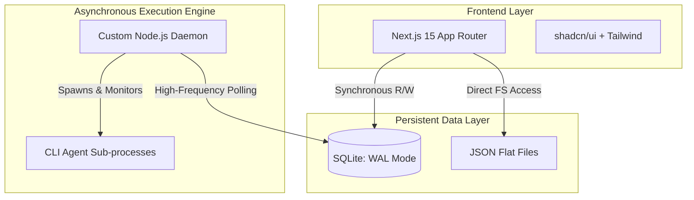

# Slide Content Guide: Anuj

**Topic:** Challenges and Learning, Solution and Demonstration (Key Fun and Outcomes), Technical Arch.

## 🧠 Essential Context You Must Know About the Project
*Before making your slides, read this so you understand exactly what we built:*
- **The Stack:** We used Next.js 15 App Router, TypeScript (strict), Zod for validation, and Tailwind with shadcn/ui for components.
- **The Concurrency Challenge:** Because the Daemon runs 5 agents at once, they all try to write to the SQLite database at the exact same time. This normally crashes SQLite. We learned to fix this by enabling WAL (Write-Ahead Logging) mode in SQLite so it can handle concurrent writes.
- **Agent Loops:** Another major challenge we faced was AI agents getting "stuck" in a loop (e.g. running a broken bash command over and over). We learned to build strict "max-turns" limits and timeout logic into our Python/Node runner so they eventually give up safely instead of running forever.

---

## Slide 1: Technical Architecture
**Goal of this slide:** Show the robust tech stack used to build Katalyst, proving deep technical competency to the judges.

**Slide Content (To put on the slide):**
- **Frontend Layer:** Next.js 15 App Router & Strict TypeScript, paired with shadcn/ui for a highly responsive, type-safe interface.
- **Data Persistence:** Hybrid architecture leveraging SQLite in WAL (Write-Ahead Logging) mode alongside lightweight JSON flat files for high-concurrency data integrity.
- **Execution Engine:** Custom Node.js background daemon orchestrating autonomous CLI agents asynchronously.

**Architectural Flow (Mermaid Diagram):**
*Embed this directly into the slide deck:*

**Deep Insight to Mention (To sound like a genius):**
- *"By decoupling our custom execution daemon from the UI layer, we achieved true strict modularity. Our architecture treats the LLM merely as an interchangeable compute node. If we need to pivot from Anthropic to DeepSeek v4, the frontend and data layers remain completely agnostic and untouched. We solved the orchestration bottleneck, not just the inference wrapper."*

---

## Slide 2: Challenges & Engineering Breakthroughs
**Goal of this slide:** Demonstrate elite problem-solving skills by highlighting the hardest systemic engineering hurdles.

**Slide Content (To put on the slide):**

| Core Engineering Challenge | Engineered Solution |
| :--- | :--- |
| **I/O Concurrency Bottlenecks:** Simultaneous multi-agent background writes causing severe `SQLITE_BUSY` lockouts. | **Write-Ahead Logging (WAL):** Migrated SQLite to WAL mode, allowing readers to operate concurrently with a single writer, eliminating deadlocks. |
| **Context Window Exhaustion:** Agents ingesting monolithic repository files, rapidly exceeding token limits and degrading response coherence. | **Heuristic File Truncation:** Engineered intelligent text management and chunking to strictly bound context injection, preserving vital system memory. |
| **Recursive Execution Loops:** Agents trapped in infinite loops, rapidly executing broken bash commands and burning compute. | **Deterministic State Failsafes:** Implemented strict "max-turns" constraints, aggressive timeout protocols, and forceful process termination to guarantee graceful failure. |

**Deep Insight to Mention (To sound like a genius):**
- *"The fundamental illusion of current AI engineering is that agents are reliable. They are not. They are chaotic, untrusted system processes. Our biggest breakthrough wasn't writing a better prompt; it was designing our daemon to enforce deterministic state failsafes. We bound the agent's execution space so tightly that even when the LLM catastrophically fails and enters an infinite loop, our engine catches the timeout and recovers the system state gracefully. We engineered for inevitable failure, which is what makes our system actually robust."*

---

## Slide 3: Solution & Demonstration (Key Fun and Outcomes)
**Goal of this slide:** End the presentation on a high note, demonstrating tangible results and a highly scalable vision.

**Slide Content (To put on the slide):**
- **The Reality:** A fully functional, locally hosted AI command center capable of asynchronous software orchestration.
- **The Automation Experience:** True "hands-off" development—assigning a multifaceted bug via a Kanban board, stepping away, and returning to committed, functional code.
- **Future Scale:** An enterprise-ready, locally-grounded architecture built to scale effortlessly from solo developers to massive, distributed engineering teams.

**Deep Insight to Mention (To sound like a genius):**
- *"The industry is currently obsessed with conversational AI—chatbots that require constant human hand-holding. What we have built here is an asynchronous delegation engine. The true paradigm shift of our project is moving from 'AI as an assistant' to 'AI as an independent worker.' By localizing the state and orchestrating via our daemon, we've demonstrated what the next decade of software development looks like: humans managing intent, while the machine manages execution."*
